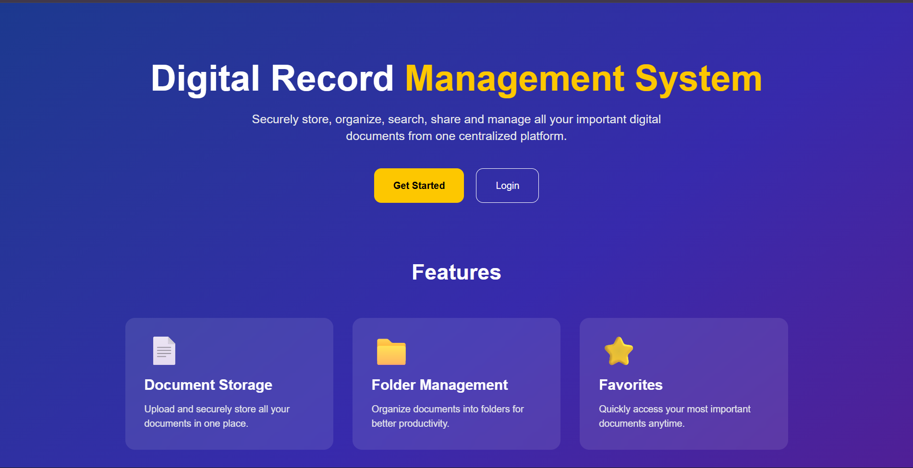
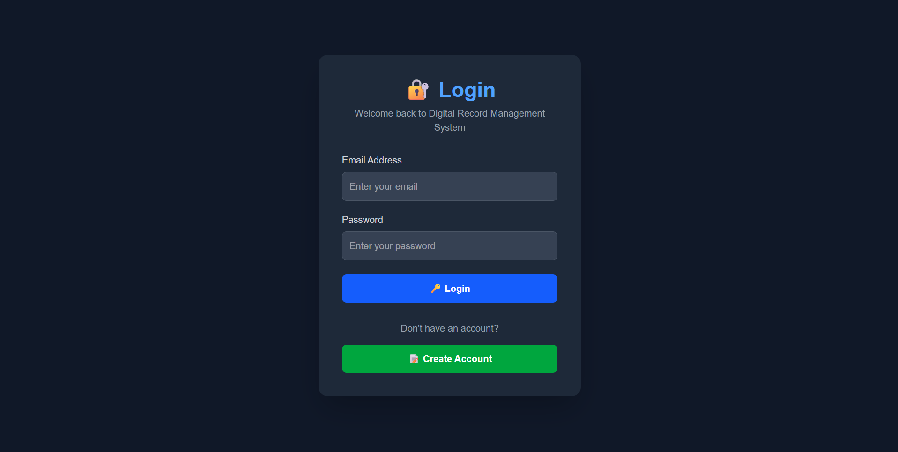
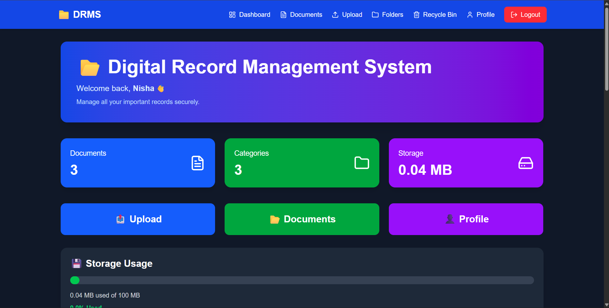
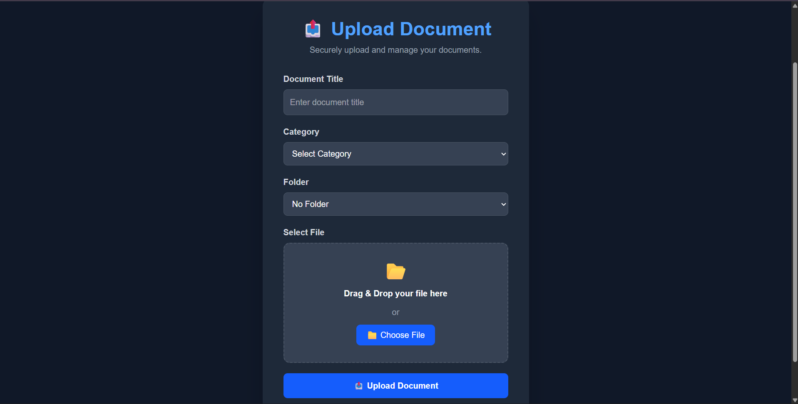
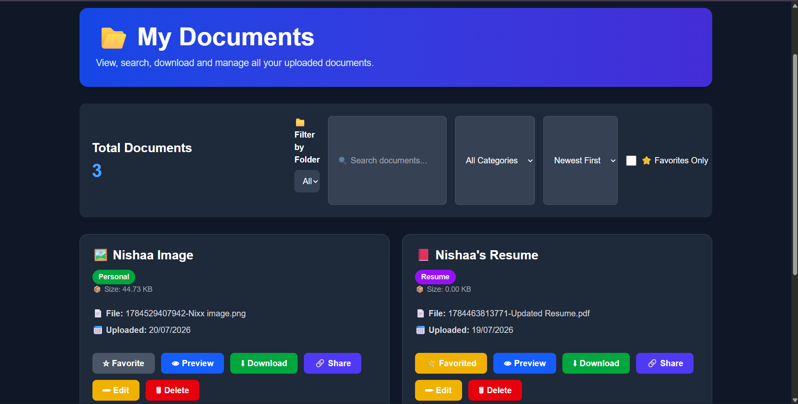

📁 Digital Record Management System (DRMS)


A full-stack web application that enables users to securely upload, organize, search, manage, and share digital documents through a centralized platform.

---

📌 Project Overview

The **Digital Record Management System (DRMS)** is designed to simplify document management by providing a secure platform where users can upload, organize, search, and manage digital records efficiently. The application includes user authentication, document upload, folder management, favorites, recycle bin, and document sharing functionalities.

---

🚀 Features

- 👤 User Registration & Login
- 🔐 JWT Authentication
- 📄 Upload Documents
- 📁 Folder Management
- ⭐ Add Documents to Favorites
- 🔍 Search Documents by Title and Category
- 🗑️ Recycle Bin
- 🔗 Share Documents
- 📊 User Dashboard
- 🔒 Protected Routes
- 📱 Responsive User Interface

---

🛠️ Technologies Used

Frontend
- Next.js
- React.js
- Tailwind CSS
- Axios
- React Toastify

Backend
- Node.js
- Express.js
- MongoDB Atlas
- Mongoose
- JWT Authentication
- Multer

Tools
- Git
- GitHub
- Visual Studio Code
- Vercel

---

📂 Project Structure

digital-record-management-system/
│
├── frontend/
│   ├── app/
│   ├── components/
│   ├── public/
│   ├── package.json
│   └── ...
│
├── backend/
│   ├── config/
│   ├── controllers/
│   ├── middleware/
│   ├── models/
│   ├── routes/
│   ├── uploads/
│   ├── server.js
│   └── package.json
│
└── README.md

---

⚙️ Installation

Clone the Repository

```bash
git clone https://github.com/nishaasubramaniam-debug/digital-record-management-system.git
```

Navigate into the project:

```bash
cd digital-record-management-system
```

---

## Backend Setup

Install dependencies:

```bash
cd backend
npm install
```

Create a `.env` file inside the backend folder.

```env
PORT=5000
MONGODB_URI=your_mongodb_connection_string
JWT_SECRET=your_secret_key
```

Run the backend server:

```bash
npm start
```

---

Frontend Setup

Install dependencies:

```bash
cd frontend
npm install
```

Run the frontend:

```bash
npm run dev
```

Open:
http://localhost:3000

---

📷 Project Screenshots

🏠 Home Page



🔐 Login Page



📊 Dashboard



📤 Upload Document



📂 Documents Page



---

🌐 Deployment

Frontend:https://digital-record-management-system.vercel.app

Backend: Localhost (can be deployed to Render or Railway for production)

---

🔐 Authentication

- Secure User Registration
- JWT-based Login Authentication
- Protected Dashboard Routes
- Secure API Access

---

📚 Future Enhancements

- Deploy Backend to Render
- Password Reset
- Email Verification
- Admin Dashboard
- Role-Based Access Control
- Cloud Storage Integration
- File Preview
- Document Version History

---

👩‍💻 Developed By

**Nishaa Subramaniam**
GitHub: https://github.com/nishaasubramaniam-debug

---

📄 License

This project is developed for educational and learning purposes.
